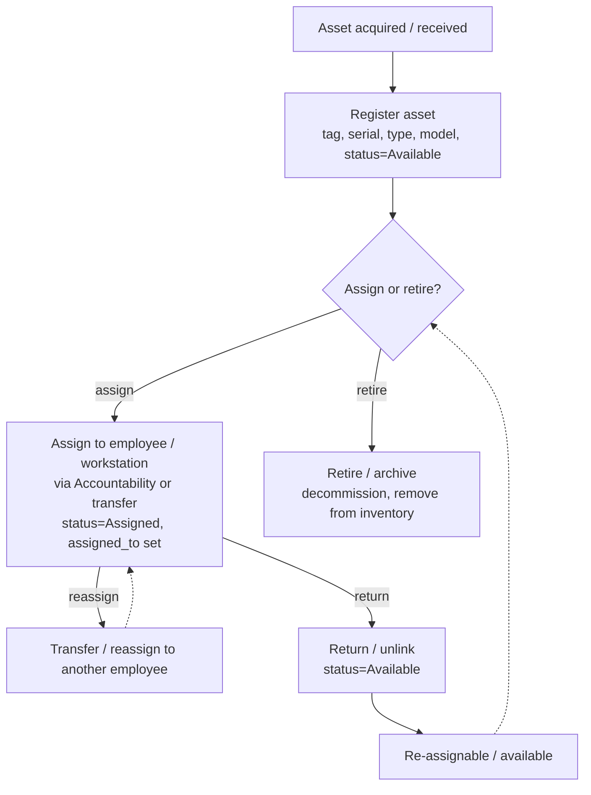
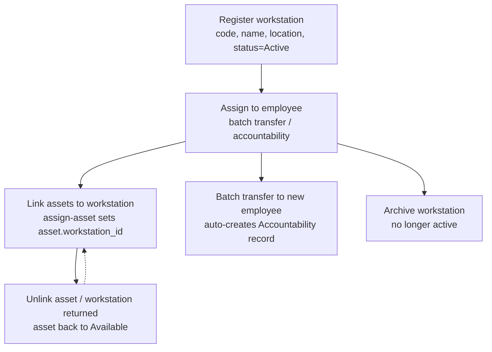
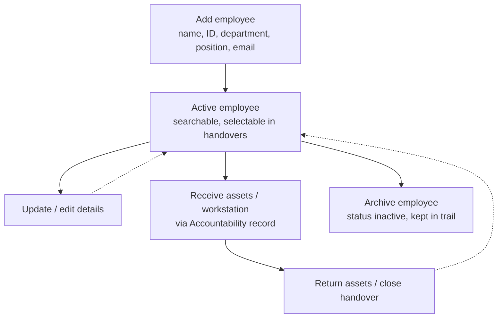
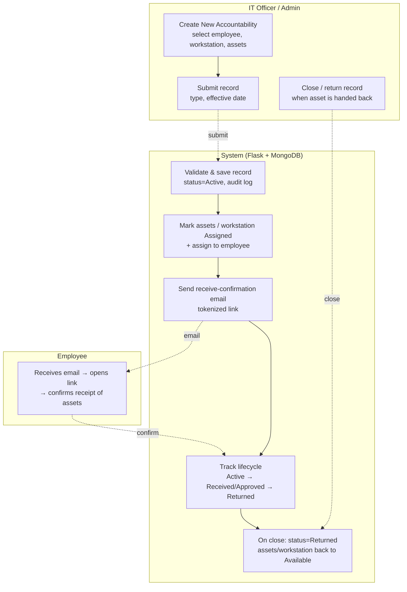
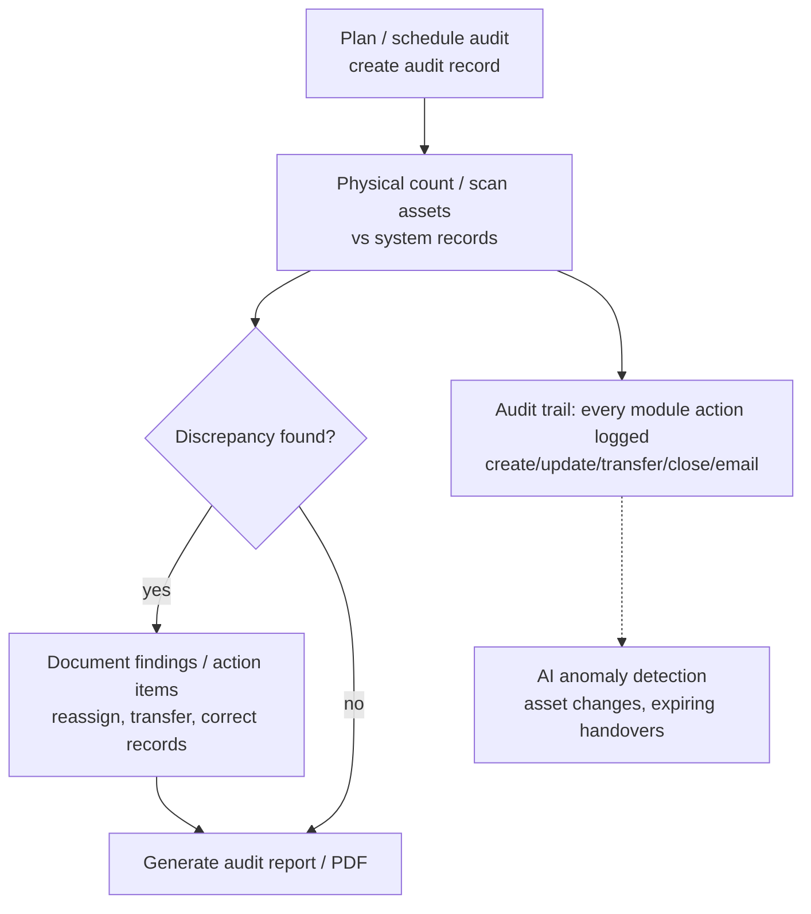

# IT Asset Management System — Process Architecture

- **Level 1** — one process flow per module (Assets, Workstations, Employees, Accountabilities, Audits).
- **Level 2** — a graph showing how the modules connect to and depend on each other.

Editable version: `process-architecture.drawio` (open in [diagrams.net](https://app.diagrams.net)).
The Mermaid diagrams below render on GitHub/GitLab/VS Code for quick review.

---

## Level 1 — Process per Module

### Assets



### Workstations



### Employees



### Accountabilities (Handover)



### Audits



---

## Level 2 — How the Modules Connect

```mermaid
flowchart LR
  EMP[EMPLOYEES<br/>master data] ---|assigned_to → employee<br/>asset held by employee| AST[ASSETS<br/>inventory]
  EMP ---|assigned_to → employee<br/>workstation assigned| WS[WORKSTATIONS]
  EMP ---|employee_id → employee<br/>record belongs to| ACC[ACCOUNTABILITIES<br/>handover records]
  ACC ---|asset_ids → assets<br/>marks them Assigned| AST
  ACC ---|workstation_id → workstation| WS
  AST ---|workstation_id / assets[]<br/>linked via assign-asset| WS
  AUD[AUDITS &amp; TRAIL] -.->|audit_log() on every action| EMP
  AUD -.->|audit_log() → trail| ACC
  AUD -.->|audit_log() → trail<br/>audit records reference assets| AST
  AUD -.->|audit_log() → trail| WS
```

### Shared data fields (which module owns what reference)

| From | To | Field / relationship | Triggered by |
|---|---|---|---|
| Assets | Employees | `assigned_to` → employee holding the asset | Accountability create, transfer, assign-asset |
| Workstations | Employees | `assigned_to` → employee holding the workstation | Batch transfer, accountability |
| Accountabilities | Employees | `employee_id` → owner of the record | Accountability create |
| Accountabilities | Assets | `asset_ids` → assets covered; status → `Assigned` | Accountability create (or link asset) |
| Accountabilities | Workstations | `workstation_id` → workstation covered | Accountability create |
| Assets | Workstations | `workstation_id` / `assets[]` → linked assets | `assign-asset`, `unlink-asset` |
| All modules | Audits | `audit_log()` → audit trail entries | Every create/update/transfer/close/email |
| Audits | Assets | audit records reference assets during physical count | Audit create |

### Cross-module actions that update MULTIPLE collections at once

1. **Creating an Accountability** → marks the selected assets **and** the workstation as `Assigned`, sets `assigned_to` on both, and records the audit log entry.
2. **Batch-transferring a workstation** → auto-creates an `Accountability` record (type "Workstation Transfer") for the new employee.
3. **Assigning an asset to a workstation** (`assign-asset`) → sets the asset's `workstation_id`, inherits the workstation's current holder as `assigned_to`, and adds the asset to the **active** Accountability if one exists.
4. **Unlinking an asset from a workstation** → asset back to `Available`, `assigned_to` cleared, and removed from the active Accountability's `asset_ids`.
5. **Closing an Accountability** → assets/workstation back to `Available`, cleared for the next handover; the timeline + audit trail are updated.

---

## Notation

- **Rounded rectangle** — process step / activity
- **Diamond** — decision / gateway
- **Swimlane** — actor or system responsible for the steps
- **Dashed arrow** — system/external handoff (email, API, auto-generated record)
- **Solid arrow** — sequential flow
